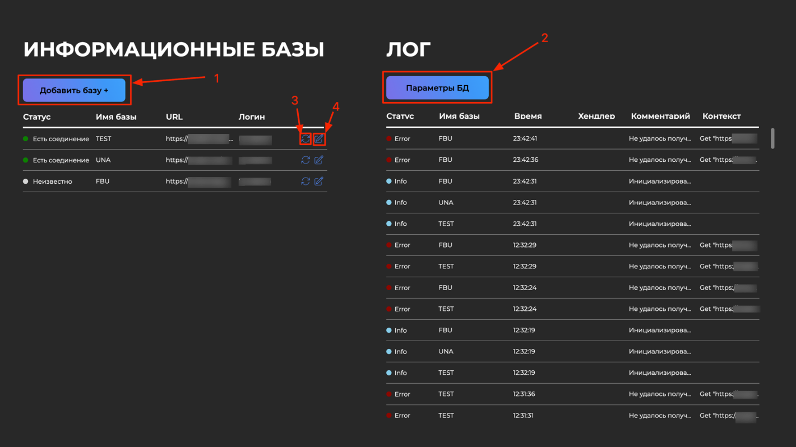

# Описание проекта

Проект предназначен для проксирования запросов API к информационным базам на платформе "1C: Предприятие 8.3".

Данный сервис даёт возможность принимать входящие запросы по протоколу HTTP и распределять на выбранную инф. базу 1С от единого клиентского подключения.

# Решаемые задачи

1. Индивидуальные клиенты подключения к информационным базам 1С - позволяет *не нагружать* отдельными сеансами к информационным базам при HTTP-соединении
2. Периодичная проверка подключения к 1С - необходим для избежания повторного *долгого* процесса авторизации
3. Единое хранение и логирование поступивших запросов
4. Единая точка входа в распределенные информационные системы 1С

# Как использовать

## Быстрый запуск

Рекомендуется с использованием Docker.
В репозитории присутствует `Dockerfile`, используйте его для создания образа контейнера.
Так же для сбора и хранения логов и служебной информации требуется развернуть СУБД `PostgreSQL`

По умолчанию для администрирования используйте веб-клиент (*http://localhost:11021*)

Порт прослушивания входящих запросов через `:10000`. Для обращения к информационной базе укажите `/proxy/{Имя базы}/...`.
Где `...` - обращение к ресурсам инф.базы по API.

Подготовьте готовый API интерефейс на стороне 1С. Так же настройте при успешном подключении по ресурсу `/` возвращаемый код HTTP `200`

## Веб-клиент

В качестве администрирования доступны следующие функции в веб-клиенте:

1. Добавление и подключение информационных баз через кнопку *Добавить базу*. требуется указать:

    - Имя базы - он же идентификатор обращения к инф.базе
    - URL - адрес опубликованной инф.базы. Например *http://localhost/MyBase/hs/api*
    - Логин - идентификатор пользователя заранее созданного и настроенного пользователя инф.базы
    - Пароль - пароль пользователя инф.базы

    База появится в списке, при удачном подключении появится соответствующий статус и поддерживаться активный сеанс

2. Настройка подключения СУБД через форму *Параметры БД*. Укажите:

    - Хост - адрес нахождения СУБД `PostgreSQL`
    - Порт - порт подключения СУБД
    - Логин - соответственно логин пользователя СУБД
    - Пароль - пароль пользователя СУБД
    - Имя базы данных - имя подключаемой БД, `заранее созданной`

    После успешного подключения появится `пропадёт` окно *База данных не подключена*

3. В случае, если подключение сеанса к инф.базе 1С отсутствует, нажмите эту кнопку для переподключения
4. Так же возможно редактирование уже существующей инф.базы, поля аналогичны *п.1*

## REST администрирование

Для администрирования прослушивается по умолчанию порт `:10001`. В пути репозитория `/client/openapi_admin.yaml`
найдете описание API интерфейса

## Доп.параметры

- В файле `/internal/models/configs.go` используются константы.

    - RetryConnectSeconds - время в секундах для повторного(периодичного) подключения к инф.базам
    - ConstCountFailedConnections - количество попыток переподключения к инф.базе. После чего соединение будет остановлено.
        Формула устаноновки значения *timeout seconds / retry connections*

- В файлах `/internal/app/app.go` и `internal/app/Gui.go` используется переменная `timeoutTime` для
    определения времени таймаута запроса. Возможно увеличение или уменьшения времени жизни запроса

- Возможно указать ресурс для "пинга" (по умолчанию `/`) инф.базы и ресурс для проксирования сервиса (по умолчанию `/proxy`).
    Это возможно указать в `/transport/rest/v1/1c_api_v1.go`

- Установлен лимит вывода записей логов в размере `200`. Возможно увеличить в методе `GetLogs()` в файле `/internal/services/database/postgres.go`

# Удаченого использования!
